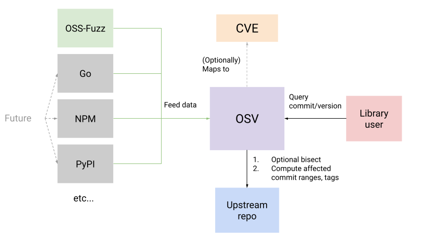

# OSV - Open Source Vulnerabilities

OSV is a [vulnerability database] and triage infrastructure for open source
projects aimed at helping both open source maintainers and consumers of open
source.

For open source maintainers, OSV's automation helps reduce the burden of triage.
Each vulnerability undergoes automated bisection and impact analysis to
determine precise affected commit and version ranges.

For open source consumers, OSV provides an API that lets users of these projects
query whether or not their versions are impacted.

[vulnerability database]: https://osv.dev/list

<p align="center">
  
</p>

## Current data sources
**This is an ongoing project.** We are hoping to work with the open source community
to [onboard more sources of data](https://github.com/google/osv/issues/44).

- [OSS-Fuzz](https://github.com/google/oss-fuzz-vulns)
- [Python](https://github.com/pypa/advisory-db) 
- [Go](https://github.com/golang/vulndb)
- [Rust](https://github.com/RustSec/advisory-db)
- [DWF](https://github.com/distributedweaknessfiling/dwflist)

For convenience, these sources are aggregated and continuously exported to a GCS bucket
maintained by OSV: [gs://osv-vulnerabilities](https://osv-vulnerabilities.storage.googleapis.com).

This bucket contains individual entries of the format `gs://osv-vulnerabilities/<ECOSYSTEM>/<ID>.json`
as well as a zip containing all vulnerabilities for each ecosystem at
`gs://osv-vulnerabilities/<ECOSYSTEM>/all.zip`

## Viewing the web UI

An instance of OSV's web UI is deployed at <https://osv.dev>.

## Using the API

```bash
  curl -X POST -d \
      '{"commit": "6879efc2c1596d11a6a6ad296f80063b558d5e0f"}' \
      "https://api.osv.dev/v1/query"

  curl -X POST -d \
      '{"version": "2.4.1", "package": {"name": "jinja2", "ecosystem": "PyPI"}}' \
      "https://api.osv.dev/v1/query"
```

Detailed documentation for using the API can be found at
<https://osv.dev/docs/>.

## Architecture

You can find an overview of OSV's architecture [here](docs/architecture.md).

## This repository

This repository contains all the code for running OSV on GCP. This consists of:

- API server (`gcp/api`)
- Web interface (`gcp/appengine`)
- Workers for bisection and impact analysis (`docker/worker`)
- Sample tools (`tools`)

You'll need to check out submodules as well for many local building steps to
work:

```bash
git submodule update --init --recursive
```

Contributions are welcome! We also have a
[mailing list](https://groups.google.com/g/osv-discuss) and a
[FAQ](https://osv.dev/docs/#tag/faq).
