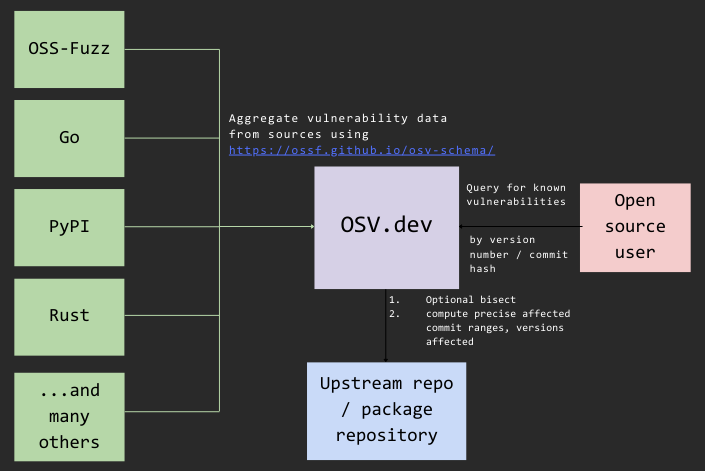

# OSV - Open Source Vulnerabilities

OSV is a vulnerability database for open source projects aimed at helping both
open source maintainers and consumers of open source.

For open source maintainers, OSV's automation helps determine accurate affected
releases and commit ranges for vulnerabilities.

For open source consumers, OSV provides an API that lets users of these projects
query whether or not their versions are impacted.

<p align="center">
  
</p>

This is an ongoing project. We are hoping to work with the open source community
to onboard more sources of data.

## Using the API

```bash
  curl -X POST -d \
      '{"commit": "6879efc2c1596d11a6a6ad296f80063b558d5e0f"}' \
      "https://api.osv.dev/v1/query?key=$API_KEY"

  curl -X POST -d \
      '{"version": "1.0.0", "package": {"name": "foo", "ecosystem": "bar"}' \
      "https://api.osv.dev/v1/query?key=$API_KEY"
```

Detailed documentation for using the API can be found at
<https://osv.dev/docs/>.

## Architecture

You can find an overview of OSV's architecture [here](docs/architecture.md).

## This repository

This repository contains all the code for running OSV on GCP. This consists of:

- API server (`gcp/api`)
- Web interface (`gcp/appengine`)
- Workers for bisection and impact analysis (`docker/worker`)
- Sample tools (`tools`)

You'll need to check out submodules as well for many local building steps to
work:

```bash
git submodule update --init --recursive
```

Contributions are welcome! We also have a [mailing
list](mailto:osv-discuss@googlegroups.com).
