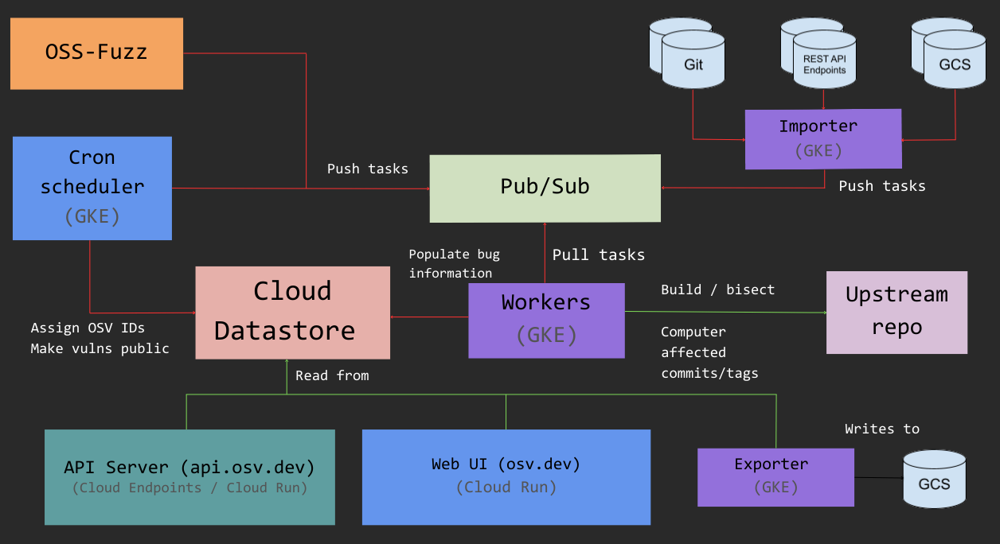

# Architecture

  

OSV runs on Google Cloud Platform, with the following main components:

## Cloud Datastore

All vulnerability data is stored in Cloud Datastore, with the models defined
[here].

## OSS-Fuzz

All of our data is currently sourced from
[OSS-Fuzz](https://github.com/google/oss-fuzz), and we are working to extend
this with other sources.

## Google Kubernetes Engine (GKE)

GKE is used for running [workers] to perform bisects and impact analysis. These
workers consume tasks from a Cloud Pub/Sub topic.

[workers]: https://github.com/google/osv/tree/master/docker/worker

[here]: https://github.com/google/osv/blob/master/lib/osv/types.py

## Cloud Run / Cloud Endpoints

The [API server] runs on Cloud Run, and is served by Cloud Endpoints.

[API server]: https://github.com/google/osv/tree/master/gcp/api

## App Engine

The main web UI (https://osv.dev) runs on [App Engine]. App Engine [cron jobs] also
schedule recurring tasks for the workers, allocate OSV IDs, and make
vulnerabilities public at the appropriate times.

[App Engine]: https://github.com/google/osv/tree/master/gcp/appengine
[cron jobs]: https://github.com/google/osv/blob/master/gcp/appengine/cron.yaml
