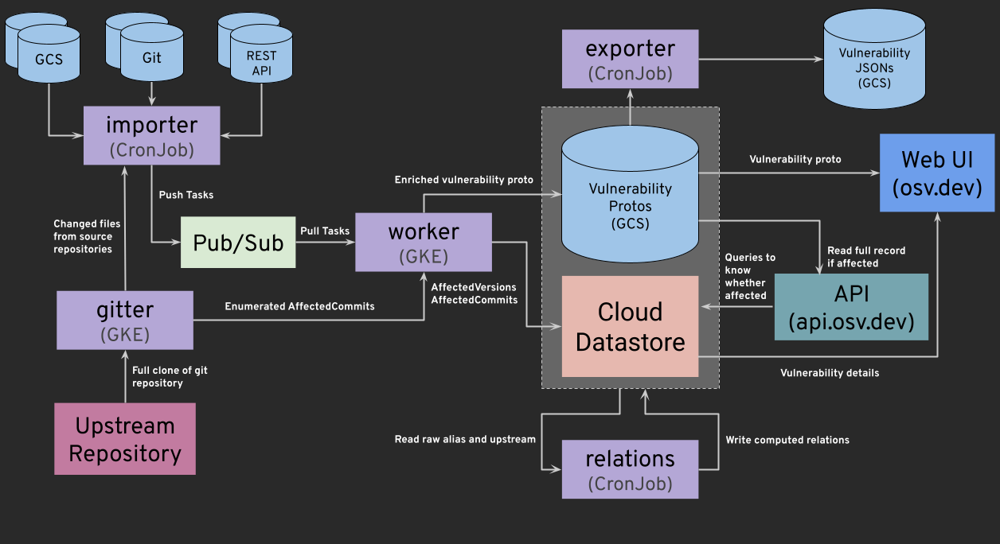

# Architecture

## Data source

Our data is sourced from a variety of
[sources](../data.md#current-data-sources), which we are looking to expand on
over time.

OSV runs on Google Cloud Platform, with the following main components:

## Cloud Datastore

All vulnerability data is stored in [Cloud Datastore] and the models are primarily defined in Go ([`go/internal/database/datastore/models.go`](../../go/internal/database/datastore/models.go)).

[Cloud Datastore]: https://cloud.google.com/datastore

## Google Cloud Storage (GCS)

Full vulnerability records (conforming to the OSV schema) are stored as protobufs and JSON files in public [Google Cloud Storage] buckets. GCS acts as the primary source of truth for the vulnerability data, while Cloud Datastore is used as an index for fast querying and API lookups.

[Google Cloud Storage]: https://cloud.google.com/storage

## Google Kubernetes Engine (GKE)

[GKE](https://cloud.google.com/kubernetes-engine) is used for running the core vulnerability processing pipeline, auxiliary background services, and legacy/OSS-Fuzz workloads. The worker node pools are spread across 1 region and 3 zones (`us-central1-a`, `us-central1-b`, and `us-central1-f`).

### Core Vulnerability Pipeline (Go-based)

These services run as native Go workloads inside the GKE cluster:

- **[importer](../../go/cmd/importer)**: A scheduled CronJob that polls and pulls vulnerability source repositories, detects additions/deletions, and dispatches processing tasks via [Cloud Pub/Sub](https://cloud.google.com/pubsub). It also manages periodic data cleanup (`importer-deleter`) and full database reconciliation (`importer-reconciler`).
- **[worker](../../go/cmd/worker)**: A daemon Deployment that consumes Pub/Sub tasks to ingest and enrich vulnerability records, compute affected commit/version ranges, and write them to GCS and Cloud Datastore. It is scaled dynamically using a HorizontalPodAutoscaler based on the Pub/Sub backlog.
- **[exporter](../../go/cmd/exporter)**: A scheduled CronJob that packages the entire OSV database (as zip files and individual JSON files) and exports them to public GCS buckets.
- **[gitter](../../go/cmd/gitter)**: A caching service Deployment that caches and precomputes heavy Git repository operations (cloning, commit graphs, patch IDs) for the importers and workers. It is backed by a large SSD Persistent Volume.
- **[relations](../../go/cmd/relations)**: A scheduled CronJob that calculates and populates transitive and reflective relationships (aliases, related, and upstream fields) between vulnerability records.
- **[recoverer](../../go/cmd/recoverer)**: A daemon Deployment that processes failed tasks (e.g., failed GCS writes, git push failures) sent to a recovery queue, attempting to heal/repair their state.
- **[indexer](../../gcp/indexer)**: A Deployment that manages git index mapping and version determination.
- **[vulnfeeds](../../vulnfeeds)**: Scheduled CronJobs that mirror and convert external vulnerability advisory feeds (e.g. NVD, Debian, Alpine) into OSV schema format.

### Auxiliary Services (Python-based)

These run as Python workloads inside GKE:

- **[vanir_signatures](../../gcp/workers/vanir_signatures)**: A scheduled CronJob that generates Vanir signatures for modified vulnerabilities.

### OSS-Fuzz Integration

- **[OSS-Fuzz workers](../../gcp/workers/oss_fuzz_worker)**: Legacy Python-based workers that perform bisection and impact analysis for ClusterFuzz/OSS-Fuzz bugs. Because these compile and run code from arbitrary open source projects, they run in Docker containers sandboxed with [gVisor](https://gvisor.dev/).

## Cloud Run / Cloud Endpoints

The [API server](../api/index.md) (hosted at `api.osv.dev`, source code in [`go/cmd/api`](../../go/cmd/api)) runs on [Cloud Run], and is served by [Cloud Endpoints] (transcoding HTTP/JSON REST to gRPC using ESPv2).

[Cloud Run]: https://cloud.google.com/run
[Cloud Endpoints]: https://cloud.google.com/endpoints

## Website

The [main web UI](https://osv.dev) (source code in [`gcp/website`](../../gcp/website)) also runs on [Cloud Run], and is served through [Cloud Load Balancing].

[Cloud Run]: https://cloud.google.com/run
[Cloud Load Balancing]: https://cloud.google.com/load-balancing
