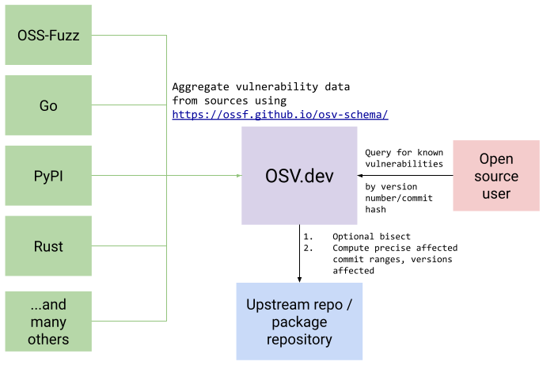

---

layout: home
---
[osv.dev] is a [vulnerability database] and triage infrastructure for open
source projects aimed at helping both open source maintainers and consumers of
open source.

This repository contains the infrastructure code that serves
[osv.dev](and other user tooling). This infrastructure serves as an aggregator
of vulnerability databases that have adopted the
[OpenSSF Vulnerability format](https://github.com/ossf/osv-schema).

[osv.dev] additionally provides infrastructure to ensure affected versions are
accurately represented in each vulnerability entry, through bisection and
version analysis.

[osv.dev]: https://osv.dev
[vulnerability database]: https://osv.dev/list

  

