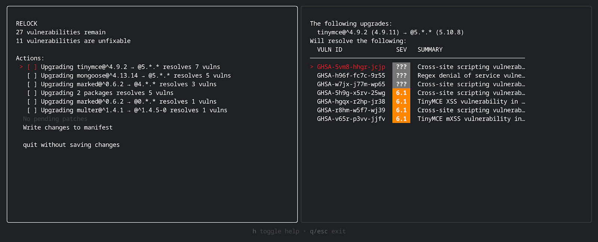

2023 has been a *very* eventful year for OSV.

## New ecosystems support

[OSV Schema](https://github.com/ossf/osv-schema) adoption continues to grow!
This year alone, 8 new ecosystems have adopted the schema, and are now
included in our [OSV.dev](https://osv.dev/list) database:

* [AlmaLinux](https://osv.dev/blog/posts/almalinux-and-rocky-linux-join-osv/)
* [Bitnami](https://github.com/bitnami/vulndb)
* [Curl](https://curl.se/docs/vuln.json) (currently blocked on [#1235](https://github.com/google/osv.dev/issues/1235) for ingestion into OSV.dev)
* [Malicious Packages](https://openssf.org/blog/2023/10/12/introducing-openssfs-malicious-packages-repository/)
* [R](https://github.com/RConsortium/r-advisory-database)
* [Rocky Linux](https://osv.dev/blog/posts/almalinux-and-rocky-linux-join-osv/)
* [Haskell](https://github.com/haskell/security-advisories)
* [Python Software Foundation](https://discuss.python.org/t/the-python-software-foundation-has-been-authorized-by-the-cve-program-as-a-cve-numbering-authority-cna/32561/3)

This has brought the total number of supported ecosystems to 20. In particular,
we have seen increased interest from Linux distributions, and expect to see
further growth in adoption in 2024.

### C/C++

C and C++ dependencies remain a critical pillar of open source supply
chains. OSV.dev's coverage of C and C++ vulnerabilities with vulnerable commit
ranges expanded significantly, with the [introduction of OSV records generated
from CVE records in the
NVD](https://osv.dev/blog/posts/introducing-broad-c-c++-support/) bringing in
over 30,000 more advisories with commit-level detail.

In conjunction with the [experimental determineversion
API](https://osv.dev/blog/posts/using-the-determineversion-api/), this enables
OSV-Scanner to be able to detect vulnerabilities in C and C++ dependencies used
as submodules or directly vendored into source code, closing one of the
remaining coverage gaps in many vulnerability scanners.

## Infrastructure

Behind the scenes, there's been a lot of work to optimize OSV.dev's API for
performance and reliability, to ensure we maintain our [Service Level
Objectives](https://google.github.io/osv.dev/faq/#what-are-osvs-service-level-objectives-slos),
which we also defined this year.

We saw peaks in API usage of over 250 QPS in November.

## Community

There’s been a very pleasing uptick in both interest and external contributions
to both OSV.dev ([23 total contributors](https://github.com/google/osv.dev/graphs/contributors?from=2023-01-01&to=2023-12-31&type=c)) and OSV-Scanner ([32 total contributors](https://github.com/google/osv-scanner/graphs/contributors?from=2023-01-01&to=2023-12-31&type=c))

We also gave an [update on OSV at the OpenSSF Day Europe](https://www.youtube.com/watch?v=WvMXsm_BEf4), in Bilbao, Spain in
September.

## Tooling
Since OSV-Scanner's launch [one year
ago](https://security.googleblog.com/2022/12/announcing-osv-scanner-vulnerability.html),
it has grown to account for at least TBD% of OSV.dev's API traffic and now
includes the following features:

* [Reachability analysis](https://google.github.io/osv-scanner/experimental/#scanning-with-call-analysis) to reduce false positives
  * [GoVulnCheck] integration to enable reachability analysis of Go vulnerabilities
  * Experimental Rust call analysis to enable reachability analysis of Rust vulnerabilities
* Comprehensive [C/C++ vulnerability management support](https://osv.dev/blog/posts/introducing-broad-c-c++-support/)
  * Git submodule scanning
  * Vendored dependency detection
* Improved ecosystem and scanning format support
  * Improved SBOM support
  * NuGet
  * ConanCenter
* An experimental [offline mode](https://google.github.io/osv-scanner/experimental/#offline-mode)
* An experimental [GitHub Action](https://google.github.io/osv-scanner/github-action/) (including SARIF output support)
* An experimental license scanning feature.

## More to come in 2024

The team is looking forward to much more to come in 2024 and the OSV schema and
OSV.dev’s third birthday in February, and OSV-Scanner’s first birthday in
December. 

We have a lot more exciting work planned in 2024, that we’ll share more details
soon. Our main priorities for 2024 are centered around data quality, as well as
providing tools for developers to help them remediate vulnerabilities faster.

The main ways we plan to progress these priorities are:

### 1. Validation and feedback mechanisms for OSV sources to ensure high data quality and consistency
As OSV schema adoption grows, it’s become even more important to ensure
consistency and high data quality across all data sources. We plan to provide
better validation tools, and build feedback channels to  make it easier for OSV
data sources to ensure high quality of data.

### 2. Accuracy and comprehensiveness of scanning
A continuing focus for OSV-Scanner is making sure that our scanning is
comprehensive and accurate. Accuracy is especially important for us, as one of
our core goals is to minimize false positives and vulnerability noise for
developers at the receiving end of the scanners.

### 3. Container scanning
OSV-Scanner has so far focused on scanning of source repositories. One important
gap we aim to fill is to provide better support for scanning of containers, in a
way that provides actionable and useful remediation guidance.

### 4. Remediation tools 
Developers are often faced with an overwhelming number of vulnerabilities
reported against their dependencies. We are currently building tooling to enable
developers to both interactively and automatically prioritize and fix the
vulnerabilities that matter in an easy way.

Here’s a quick preview of what we have been working on: 

