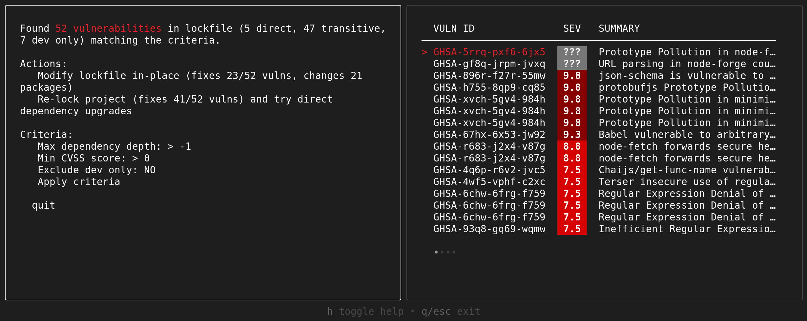
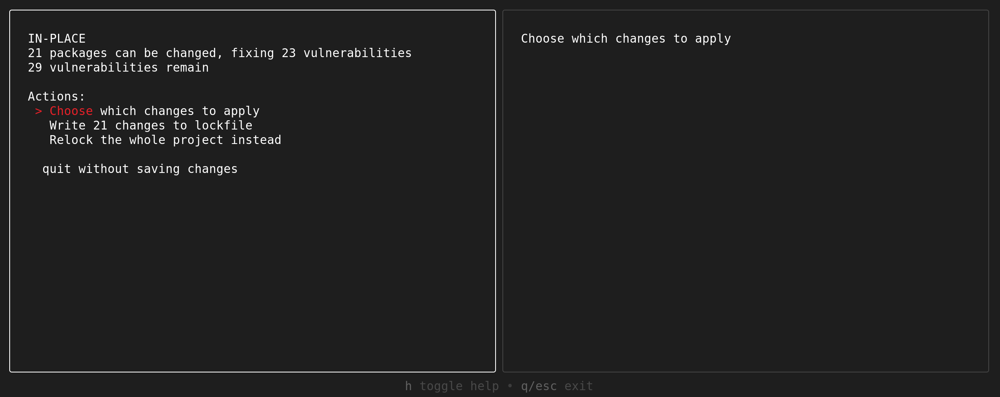
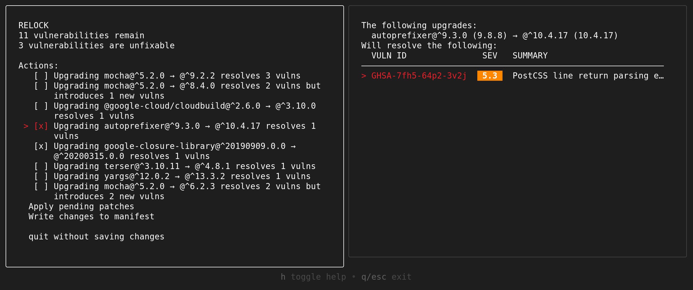

Addressing vulnerabilities in project dependencies can often be overwhelming for software developers. OSV-Scanner's new [Guided Remediation feature](https://google.github.io/osv-scanner/experimental/guided-remediation/) aims to simplify this process by prioritizing and fixing the vulnerabilities that matter most in your projects.
<!--more-->
The tool is now available with the OSV-Scanner 1.7.0 release under the `osv-scanner fix` subcommand. Currently, it only supports npm `package.json` / `package-lock.json` dependencies, but we're planning to expand support to more ecosystems in the future.


## What can Guided Remediation do?
Guided Remediation scans your project's manifest and lockfile, identifying vulnerable dependencies and suggesting upgrades that will resolve them. There are two different upgrade strategies to choose from:
- In-place lockfile modification, which does targetted updates to vulnerable packages while still maintaining compatibility with the existing constraints in your dependency graph.
- Relocking and relaxing requirements, to install the most up-to-date versions of your dependencies and upgrade your direct requirements to remove vulnerable packages from the dependency graph.

In conjunction with these strategies, the tool also allows you to filter vulnerabilities based on metrics like CVSS severity, dependency depth, and whether they affect production or development dependencies. This allows you to control which vulnerabilities you wish to target.

## Using Guided Remediation
For basic usage, you can attempt to resolve as many vulnerabilities as possible in your manifest/lockfile with one of the following commands:

```bash
osv-scanner fix --non-interactive --strategy=in-place -L path/to/package-lock.json
```
```bash
osv-scanner fix --non-interactive --strategy=relock -M path/to/package.json -L path/to/package-lock.json
```

For more complex scenarios, the interactive mode provides finer control over the remediation process.
```bash
osv-scanner fix -M path/to/package.json -L path/to/package-lock.json
```




All filtering metrics found in the interactive mode are also available as CLI flags for the non-interactive mode, allowing you to integrate and automate guided remediation in your CI/test pipelines.

See our [detailed documentation](https://google.github.io/osv-scanner/experimental/guided-remediation/) for more usage information.

## Try it yourself!
If you have any npm projects with known vulnerabilities, try Guided Remediation today! It's available in the [latest OSV-Scanner release](https://github.com/google/osv-scanner/releases/latest) and we'd love to hear your [feedback](https://github.com/google/osv-scanner/issues).
