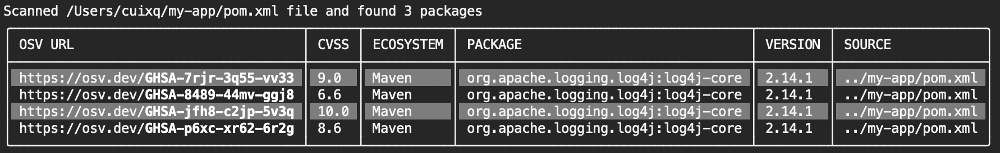

We are excited to announce that OSV-Scanner now supports transitive dependency scanning for Maven pom.xml.

This highly requested [feature](https://github.com/google/osv-scanner/issues/35) empowers you to detect vulnerabilities in both your direct and indirect dependencies in the Maven ecosystem, giving you a complete picture of your project's open source security. With this feature, OSV-Scanner fixes one out of two ecosystems/formats when it comes to transitive scanning capabilities.

<!--more-->

## How does it work?

OSV-Scanner first uses [deps.dev’s Maven parser library](https://pkg.go.dev/deps.dev/util/maven) to generate an effective POM which includes project inheritance, importing managed dependencies and project interpolation. This may involve fetching Maven projects from Maven Central repository.

OSV-Scanner then invokes [deps.dev’s resolver library](https://pkg.go.dev/deps.dev/util/resolve) to compute a dependency graph for the processed project. This graph includes all the direct and transitive dependencies of your project. Maven requirements are provided by the [deps.dev API](https://docs.deps.dev/api/v3/#getrequirements).

After the dependency resolution, OSV-Scanner queries the OSV.dev database for vulnerabilities associated with these dependencies.

## Using transitive dependency support

This feature is enabled by default in OSV-Scanner when you scan a file or a directory of your Maven project.

```bash
osv-scanner -r path/to/your/directory
```

```bash
osv-scanner -L path/to/your/pom.xml
```

```bash
osv-scanner -L pom.xml:path/to/your/file
```

For example, a project only declares the following direct dependency in pom.xml, but vulnerabilities of the transitive dependencies are also reported by OSV-Scanner.

```xml
<dependency>
    <groupId>org.apache.logging.log4j</groupId>
    <artifactId>log4j-web</artifactId>
    <version>2.14.1</version>
</dependency>
```



Transitive dependency support is disabled in the [experimental offline mode](https://google.github.io/osv-scanner/experimental/offline-mode/).

See our detailed documentation for more usage information on [transitive dependency scanning]((https://google.github.io/osv-scanner/supported-languages-and-lockfiles/#transitive-dependency-scanning)).

## Try it today!

Transitive dependency support for Maven is available in [OSV-Scanner version 1.8.0](https://github.com/google/osv-scanner/releases/tag/v1.8.0). This feature can help you to improve the security of your Maven projects so give it a try, and we would love your [feedback](https://github.com/google/osv-scanner/issues/new).
