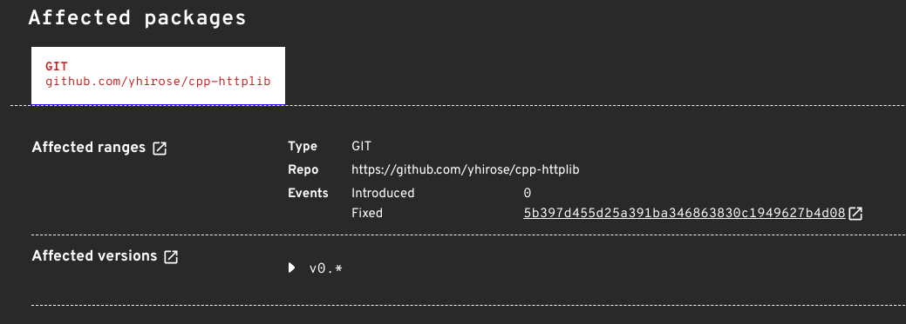

OSV is committed to bringing our users comprehensive, accurate and timely open source vulnerability information. Over the last year, we’ve released a number of new features in pursuit of this goal including:
- [OSV-Scanner’s call graph analysis for Go and Rust](https://google.github.io/osv-scanner/experimental/#scanning-with-call-analysis)
- Adding six new ecosystems to the database
- [The determineversion API](https://osv.dev/blog/posts/using-the-determineversion-api/), which expanded access to C/C++ vulnerabilities for OSS-Fuzz projects 

Today we are announcing that OSV advisories now include vulnerable commit ranges. **Vulnerable commit ranges, along with the previously announced experimental determineversion API, will enable vulnerability management for software with C and C++ dependencies, which has been one of the last gaps in coverage in OSV.dev’s database.**
<!--more-->

Because the C/C++ ecosystem doesn’t have a centralized package register, source code identifiers (e.g. git hashes) are the best way to identify C/C++ libraries. Typically vulnerabilities are associated with versions, not git hashes, making C/C++ vulnerability matching difficult. The new commit level vulnerability information will allow users to confidently match their dependencies to known vulnerabilities within the OSV database. 

Vulnerable commit ranges provide a granular approach that more closely follows the development process, matching vulnerabilities to a range of upstream commits instead of matching vulnerabilities to a package version. This precise information allows for accurate identification of git branches cut from known vulnerable commits and leads to more accurate vulnerability information.

## How are vulnerable commit ranges included in the OSV database?

We’ve enriched over 30,000 advisories based on the [NVD CVE database](https://nvd.nist.gov/vuln/search). We’ve added vulnerable commit ranges to these advisories by using algorithmic analysis to match git repository tag information to patch information supplied by the NVD CVE entry. 

As part of our work in this area, we've established working relationships with the NVD via data quality fixes and longer term systematic improvements.


Sample OSV advisory with commit range information.

## Finding C/C++ vulnerabilities with vulnerable commit ranges

Matching C/C++ dependencies to known vulnerabilities has been one of the final pieces in the puzzle of a truly comprehensive open source vulnerability database. Most projects with C/C++ dependencies include a copy of those dependencies bundled with the project, either by using submodules or by vendoring dependencies. Whether dependencies are submoduled or vendored, Vulnerable commit ranges allow OSV users to match their dependencies to known vulnerabilities. 

### Submoduled C/C++ dependencies

Submoduled dependencies retain their git histories. With a few simple git commands, it’s possible to know the current git commit hash for every dependency. Once the relevant git hash is known, we can use the [OSV API](https://google.github.io/osv.dev/post-v1-query/) to find any corresponding vulnerabilities. 

For example, let’s take a look at the dependencies for the [pd-server](https://github.com/charlesneimog/pd-server) project and see if we can find any vulnerabilities. Pd-server is a PureData interface to cpp-httplib and includes cpp-httplib as a submoduled dependency. 

For this example, we’ll be working from the commit `cf3f15a841ca21b53c6de654c9981a30ae0b590c`.

To determine whether pd-server’s cpp-httplib copy has any known vulnerabilities, first determine the copy’s most recent commit hash by following these steps in your terminal:

1. Recursively clone the pd-server project to your local machine using `git clone --recursive https://github.com/charlesneimog/pd-server`
2. Navigate into the pd-server project folder using `cd pd-server`
3. Checkout relevant commit using `git checkout cf3f15a841ca21b53c6de654c9981a30ae0b590c`
4. Update submodules using `git submodule update` to update submodules to relevant commit
5. Determine the most recent commits for each submodule `git submodule status` 

```
git clone --recursive https://github.com/charlesneimog/pd-server
cd pd-server
git checkout cf3f15a841ca21b53c6de654c9981a30ae0b590c
git submodule update
git submodule status
 5c2e137f7a7a03f4007494954ccb3e23753e7807 pd-lib-builder (v0.6.0-28-g5c2e137)
 227d2c20509f85a394133e2be6d0b0fc1fda54b2 src/cpp-httplib (v0.11.3-6-g227d2c2)
 4c6cde72e533158e044252718c013a48bcff346c src/json (v3.11.2-39-g4c6cde72)
 1b11fd301531e6df35a6107c1e8665b1e77a2d8e src/websocketpp (0.8.2-1-g1b11fd3)
```

Cpp-httplib’s most recent commit hash is `227d2c20509f85a394133e2be6d0b0fc1fda54b2`. We can now use this information to construct an API call. It will be in this form:

```
curl -d \
  '{"commit": "227d2c20509f85a394133e2be6d0b0fc1fda54b2"}' \
  "https://api.osv.dev/v1/query" | jq '.vulns | map(.id)'
```
 Which returns:
```
[
  "CVE-2023-26130"
]
```
This result shows that the pd-server project is vulnerable to [CVE-2023-26130](https://osv.dev/vulnerability/CVE-2023-26130) at git commit ‘cf3f15a841ca21b53c6de654c9981a30ae0b590c’ through its use of cpp-httplib. Fortunately cpp-httplib has [a fix](https://github.com/yhirose/cpp-httplib/commit/5b397d455d25a391ba346863830c1949627b4d08) and pd-server updated their copy of cpp-httplib. The pd-server project is no longer be vulnerable to CVE-2023-26130. 

### Vendored C/C++ dependencies

Vendored dependencies are included in a project by simply copying the code into the repository. Git commit information is not retained, so we need another way to determine whether a vulnerability is present. 

The determineversion API estimates your dependency’s version by comparing files hashes from your local project to known hashes for a given version. Once your dependency version is known, you can find the relevant vulnerabilities through searching our database or using our API.

When we released the API in July, its use was limited to vulnerabilities found by [OSS-Fuzz](https://google.github.io/oss-fuzz/). Not all C/C++ projects are part of OSS-Fuzz, nor are all vulnerabilities for a given dependency found by OSS-Fuzz, so a number of vulnerabilities were left on the table. With the addition of the commit level vulnerability data from the NVD, this gap has been significantly narrowed. **This means that the determineversion API may now be used for the majority of vendored C/C++ dependencies.** 

For more information on how to use the determineversion API, please see our [documentation](https://google.github.io/osv.dev/post-v1-determineversion/) or this [walkthrough](https://google.github.io/osv.dev/post-v1-determineversion/). 

Within the next few months, support will be added to OSV-Scanner to make this a seamless out of the box experience for developers. Follow [this issue](https://github.com/google/osv-scanner/issues/82) for updates.

## Try it yourself!

Do you have a project that uses C/C++ dependencies? We encourage you to try our new vulnerable commit range features and [let us know](https://github.com/google/osv.dev/issues/new/) about your experience. If you encounter a data issue, please fill out a [data quality report](https://github.com/google/osv.dev/issues/new?assignees=&labels=data+quality&projects=&template=converted-nvd-cve-data-quality-report.md&title=Data+quality+issue+with+CVE-yyyy-nnnn). Your contributions, questions, and feedback will help us improve not only the quality of our data, but will ultimately help users identify and fix vulnerabilities in their projects. 