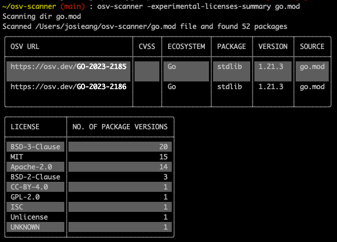
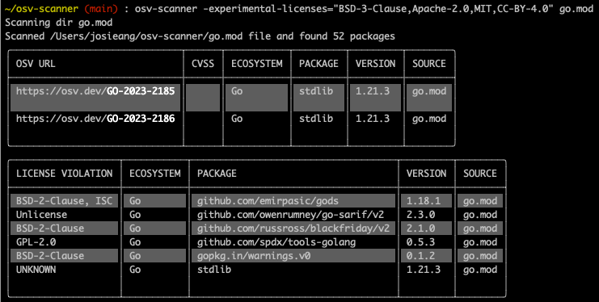

[OSV-Scanner’s](https://google.github.io/osv-scanner/) primary goal is to help developers match project dependencies to known vulnerabilities. But vulnerability information is not the only metric used to determine packages (and versions) to include in a project. Understanding which licenses your dependencies use can help you decide whether to include a particular package in your project. [Packages can](https://thenewstack.io/hashicorp-abandons-open-source-for-business-source-license/) [also be relicensed](https://www.zdnet.com/article/elastic-changes-open-source-license-to-monetize-cloud-service-use/), which means that license checking is important not only at ingestion, but as part of long-term dependency maintenance and management.

Today we are introducing [OSV-Scanner license compliance scanning](https://google.github.io/osv-scanner/experimental/#license-scanning). 

With this new, experimental flag in OSV-Scanner, you can now view the license composition of the packages in your project and filter for packages license violations based on a user-provided set of allowable licenses. The license data comes from the [deps.dev](http://deps.dev) API.

## Using the tool

The experimental license scanner is run using the following command: `osv-scanner –experimental-licenses-summary path/to/directory`.

OSV-Scanner will print out a table with a package version count for each license. This is helpful to get an overview of what kinds of licenses are in your dependencies. 

You can specify allowed licenses using: `osv-scanner –experimental-licenses='<comma-separated list of allowed spdx licenses>' path/to/directory`. When specifying allowed licenses, OSV-Scanner will show a more detailed view of each package that has a license outside of the allowed license set.

## Deps.dev

The license data for this feature is sourced from the deps.dev API. Deps.dev computes and collects metadata and insights into millions of open source packages and exposes this data through a [website](https://deps.dev/), a free [API](https://docs.deps.dev/api/v3alpha/), and a [BigQuery dataset](https://docs.deps.dev/bigquery/).

Deps.dev reads Cargo, Maven, npm, NuGet and PyPI licenses from the package metadata. For Go, licenses are determined by deps.dev using the [licensecheck package](https://github.com/google/licensecheck). For more information on where deps.dev gets this data from, see our [license FAQ](https://docs.deps.dev/faq/#how-are-licenses-determined).

## Try it today!

License scanning is available for OSV-Scanner version 1.5.0. Upgrade your version of OSV-Scanner, give it a try, and let us know of any [feedback](https://github.com/google/osv-scanner/issues/new) you have. We hope this feature helps you to stay on top of the licenses in your project!
