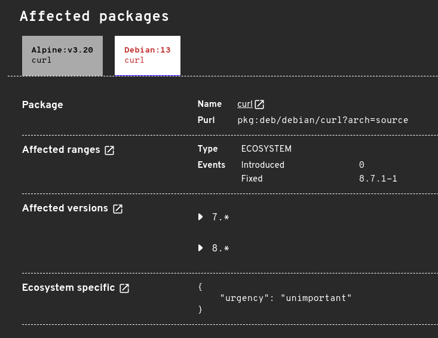

OSV.dev aims to be a comprehensive database for all known vulnerabilities in open source ecosystems. One of the more recent areas of focus is Linux distributions, which are important in the context of container scanning. To enable comprehensive scanning support for Debian based containers, we've integrated more vulnerability data from Debian Security Tracker into our OSV database.

A [sample CVE entry](https://osv.dev/vulnerability/CVE-2024-2466) with Debian information. 

## What is Debian Security Tracker?
The [Debian Security Tracker](https://security-tracker.debian.org/tracker/) is a database maintained by Debian's security team to track Debian related security vulnerabilities. It aggregates information from various sources, including [Debian Security Advisories](https://www.debian.org/security/#DSAS) (DSAs), the [Common Vulnerabilities and Exposures](https://www.cve.org/) (CVE) database, the [National Vulnerability Database](https://nvd.nist.gov/) (NVD), and the [Debian bug tracking system](https://www.debian.org/Bugs/) (BTS). This makes the security tracker comprehensive, providing a complete record of reported Debian security vulnerabilities.

## Why do we need it?
Previously, OSV relied solely on Debian Security Advisories (DSAs) and Debian Long Term Support Advisories (DLAs) for Debian related vulnerability information. While these are official sources, they only cover issues that have been formally [acknowledged and patched](https://www.debian.org/doc/manuals/securing-debian-manual/dsa.en.html) by the Debian team. This left a blind spot in our scanning reports – unfixed vulnerabilities, where the security issue has been reported but a fix has not been made available yet in Debian.

Debian Security Tracker fills this gap by providing all reported issues even if the vulnerability has not been fixed yet.

## Prioritizing Vulnerabilities
The tracker categorizes vulnerabilities by [urgency levels](https://security-team.debian.org/security_tracker.html#severity-levels): "low", "medium", "high", "unimportant", "not yet assigned", and "end-of-life". This urgency level reflects Debian's internal prioritization and indicates how quickly a fix may be needed.

To maintain accuracy while expanding our database, we've made the following decisions on how to prioritize these vulnerabilities:

- **Important vulnerabilities:** Vulnerabilities tagged as "low", "medium", "high", and "end-of-life" are added into our database into corresponding CVE entries. These vulnerabilities will be displayed when scanning a Debian image. 
- **Unimportant vulnerabilities:** Vulnerabilities marked as "unimportant" are also added into our database but are hidden by default in OSV-Scanner results. This is because those vulnerabilities typically do not affect users, but in some rare cases, they might. In the future, when container scanning for Debian Docker images is fully implemented, users can choose whether to include these vulnerabilities in their reports.
- **Untriaged vulnerabilities:** Vulnerabilities marked as "not yet assigned" are not added to our database, as the Debian team may soon evaluate and update their status.

## Coming Soon: More comprehensive Container Scanner in OSV-Scanner
OSV-Scanner has previously focused on being a vulnerability scanner that scans code repositories, with limited support for Docker containers. This year, we’re focusing on providing more full featured support for Docker container scanning.

While working on this, we've noticed some interesting findings regarding how popular scanners produce different container scanning results. These differences aren't just limited to Debian related data, but also extend to language packages, like Go, npm and others. Stay tuned for an upcoming blog post where we will dive into this topic, comparing scanner results and exploring the nuanced reasons behind these differences.
