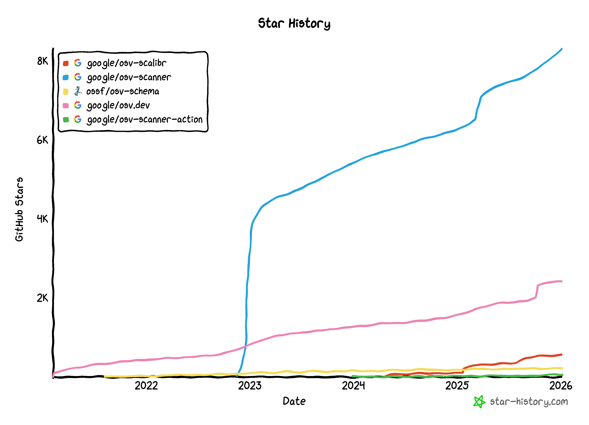

2025 has been an eventful year for OSV, marked by significant expansion, infrastructure improvements, and continued community growth across all our projects.

<!--more-->

## OSV Data Adoption and Improvements

We welcomed 11 new data providers, and 11 new ecosystems. Every new data provider helps us improve vulnerability coverage and matching for the open source community.

**Data Providers:**
- [BELL] BellSoft
- [CLEANSTART] CleanStart (Coming Soon)
- [DRUPAL] Drupal
- [DHI] Docker Hardened Images (Coming Soon)
- [ECHO] Echo
- [EEF] Erlang Ecosystem Foundation
- [FreeBSD] FreeBSD (Coming Soon)
- [JLSEC] Julia
- [MINI] Minimus
- [OESA] openEuler
- [V8] V8

**Ecosystems:**
- Alpaquita
- BellSoft Hardened Containers
- CleanStart
- Docker Hardened Images
- Echo
- FreeBSD
- Julia
- Kubernetes
- MinimOS
- openEuler
- VSCode

### CVE Data Ingestion

We’ve also begun to diversify our CVE matching data by ingesting directly from the CVE Program’s CVEList as well as the NVD, allowing for more accurate vulnerable ranges. Look out for an upcoming blog post going deeper into this project.

### Decoupling Alpine and Debian Data

Following the introduction of the `upstream` field last year, we have separated the Debian and Alpine vulnerability data, which were previously merged with the main NVD CVE record-into distinct records, each with its own prefix. This ensures records only apply to the environments they exist in, significantly reducing false positives–such as preventing Debian vulnerability alerts from appearing on Alpine systems.

## Infrastructure and Data Quality

Behind the scenes, we've focused on ensuring OSV.dev remains fast and reliable.

### API Improvements
Early last year, we [announced the significant improvements on the performance and reliability of the OSV.dev API](https://osv.dev/blog/posts/api-latency-improvements-and-revised-slos/). By implementing a new database indexing strategy, we made API queries up to 5 times faster. This is a substantial improvement, with the 95th percentile latency for batch queries dropping from ~10 seconds to ~3 seconds. This speed increase unlocks new possibilities for real-time CI/CD integration, allowing developers to scan against the API without hitting timeout thresholds. Following these enhancements, we have revised our API SLOs to reflect this new, higher standard of performance.

### Vanir Signature Integration

[Vanir](https://github.com/google/vanir) signatures are now available through OSV.dev. To enhance Vanir's coverage of open-source libraries, the OSV.dev worker is now responsible for generating and processing Vanir signatures for all vulnerabilities with GIT affected ranges. In addition, a new public data dump is now available, which provides a JSON file listing all GIT vulnerabilities that have Vanir signatures. This file is designed to simplify the use of Vanir's offline directory scanner.

### OSV linter

On the data quality front, we launched an [experimental OSV linter](https://test.osv.dev/linter) to help maintain high consistency across all incoming vulnerability data. This tool checks for consistency beyond schema validation, ensuring high-quality, usable vulnerability data. It allows OSV record creators to integrate these essential quality checks into their workflows, leading to more accurate and immediately useful information.

### Standardizing core data structure

We significantly reorganized our core data structures last year to improve consistency and simplify development:
 - Migrating `vulnerability.proto` to **OSV-Schema**, establishing it as the authoritative source of truth alongside `schema.json`.
 - Transitioning away from manually maintained language bindings in favor of reliable, automatically generated protobuf code.

This standardization allowed us to successfully deprecate manual bindings across the entire OSV ecosystem. For the open-source community, this eliminates the risk of inconsistencies between protocol definitions and language bindings, while removing the need for tedious manual data conversion.

## Community

Last year saw sustained interest and external contributions across all our major repositories:
 - **OSV Schema**: 32 contributors
 - **OSV.dev**: 28 total contributors
 - **OSV-Scanner**: 33 total contributors
 - **OSV-Scalibr**: 52 total contributors

Notably, the **OSV-Scanner GitHub Action** has been adopted by **over 1600 GitHub repositories**, demonstrating its value to the developer community.

### Conferences

We also engaged with the community at several key events, with OSV-related presentations at:
 - **VulnCon (Raleigh):** Presented [“Let’s Talk About Fitness for Purpose: Comparing and Contrasting the CVE List with OSV.dev”](https://youtu.be/qHcpKW2nOqI?si=IXJ_B7qfdlU0DnOs)
 - **RSAC Conference (San Francisco)**
 - **Open Source Summit (Denver):** Presented [“Navigating the Sea of CVEs: Securing Your Linux Distribution”](https://youtu.be/Vsp-RuwJM8c?si=YBc-vQS9ZSuSArh4)
 - **OpenSSF Community Day (Denver):** Presented [“Myths Developers Believe About Open Source Security”](https://youtu.be/bjEyIPSpLRw?si=P9mwNM5TtK8e9Z9N)
 - **Diana Initiative (Las Vegas):** Presented [“Insecurity in Security: Maintainer Support”](https://youtu.be/l5VJtpuqYTM?si=n2VxkFRZl7MOXPJo)
 - **Google Developer Groups DevFest (Sydney and Auckland)**

## Tooling

Our tooling (OSV-Scanner and OSV-Scalibr) continues to evolve with a focus on developer experience and accuracy. Key updates last year include:
 - **Scalibr feature unification** to streamline the tooling experience.
 - Launch of an **experimental MCP server**, allowing AI agents (like Claude or ChatGPT) to query the OSV database directly for live vulnerability intelligence.
 - Enhanced Python vulnerability management including **transitive dependency scanning for `requirements.txt`** and **Guided Remediation for Python**.
 - Improvements to **Reachability Analysis for Java**.

## More to Come in 2026

We're already looking forward to the year ahead with ambitious goals to continue improving OSV.

**Data Precision and Trust:**
 - Delivering higher quality CVE records
 - Achieving full filesystem accountability
 - Introducing a public metrics dashboard

**AI and Automation:**
 - Expanding VEX support and reachability features
 - Integrating LLM agents to further assist developers
