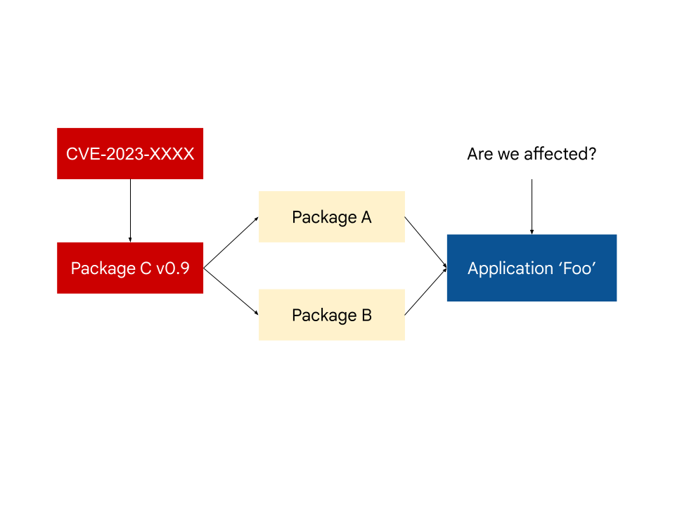

If you've recently been in the space of vulnerability management and the discussions around the White House [Executive Order on Improving the Nation's Cybersecurity (EO)](https://bidenwhitehouse.archives.gov/), you're probably familiar with concepts such as Software Bill of Materials (SBOM) and Vulnerability Exploitability eXchange (VEX).

A VEX document/statement—a form of a security advisory that indicates whether a product or products are affected by a known vulnerability or vulnerabilities—provides a great starting point in prioritizing vulnerability response and automating risk evaluation of software, especially for software consumers. There has already been a lot of coverage on consuming and using VEX for vulnerability management. However, there has not been much conversation around the generation of VEX documents. For producers, the process of creating a VEX statement today is largely a manual and cost-intensive process.
<!--more-->

In this post, we discuss the problems in generating VEX, provide recommendations for how to implement VEX at scale (which will require industry-wide effort), and explain how Open Source Vulnerabilities (OSV) can help.

## The problem

Even before the introduction of VEX, some teams within software organizations responded to customers' independent vulnerability scans with VEX-like data, often in ad hoc formats. Typically these teams maintain an internal list of vulnerabilities and information about whether (and how) they are affected by each one. Generating a VEX statement would just be a translation of this existing list.

Great… right? Not quite. Assembly of this list today is largely manual and requires engineers to request information from internal and open-source code owners of components that use these vulnerable dependencies. The complexity of dependencies in modern software makes this a cost-intensive process, which creates a barrier to entry for organizations to generate accurate VEX statements. 

This manual process today results in a lot of duplicated work in the investigation of vulnerabilities and requires a lot of deep expertise. For example, if we have an application that uses an open source library (e.g. Spring) containing a vulnerable package (e.g. log4j), each organization that uses that library would need to have enough Spring expertise to accurately evaluate whether the vulnerability is being exercised. More specifically, someone that is familiar with the consumer library, Spring, may know that the calls made to the vulnerable function do not include input from the user, and therefore the vulnerability cannot be triggered.

So how can we make this better? 

## Intermediate VEX statements

Say you're developing an application Foo, and a vulnerability CVE-2023-XXXX is reported in Package C. You run a vulnerability scanner on your dependency graph or SBOM and see the vulnerability reported. Now you have to triage the vulnerability and either patch, or create a VEX statement if the vulnerability does not actually affect the application. 



Package C is a transitive dependency of application Foo, but a direct dependency of Package A and B. If the authors of Package A and Package B ran a vulnerability scanner on their own dependencies, they would have also seen a vulnerability match on Package C. 

If Package A and B both publish a VEX statement declaring that they aren't directly affected by the vulnerability in Package C, then a Foo application developer could conclude that their project is similarly unaffected.


If at least one path to the vulnerable Package C has a VEX statement indicating that it's vulnerable, or does not provide an intermediate VEX, then the default should be to assume Foo is affected. Even if this does not turn out to be the case, the amount of investigation the authors of Foo have to do is reduced by every VEX statement that reports being unaffected. 


## Intermediate VEX format and storage

What exactly would an intermediate VEX statement look like? It could just be an ["ignore file"-like mechanism](https://google.github.io/osv-scanner/configuration/#ignore-vulnerabilities-by-id) to encode false positives with justification for direct dependencies that gets passed to a vulnerability scanner. Library developers could also regularly run vulnerability scans on their dependencies, analyze the results and encode false positives in intermediate VEX statements.

There are a number of ways to maintain intermediate VEX statements in either source code repositories or as a part of metadata served by package managers. To better illustrate this, here is an example using a text file ".vex" which can exist within a git repository's root directory. The code owner can maintain this file to reflect the intermediate VEX, similar to other metadata files like LICENSE, or MAINTAINERS.

Let's take an example of a code base of a library called "mylib". Within its intermediate .vex file, they can encode lines which describe how its dependencies are not affected by known CVEs

```bash  
$ cat .vex  
libfoo, CVE-2022-123456, NOT_AFFECTED, inline_mitigations_already_exist  
libbar, CVE-2022-654321, NOT_AFFECTED, vulnerable_code_not_in_execute_path  
```

Let's explore what it would look like from an application "myapp" using "mylib". Traditionally, without the .vex file, the user of "mylib" would see that they have two CVEs for "libfoo" and "libbar". To know if they truly are affected by the CVEs, they would need to understand and analyze the code of "mylib". However, now with the .vex file, they would now be able to reason that "myapp" isn't affected by the CVEs. 

This is a fairly simple example, but extrapolating to deeper nested dependencies, we can see how having each library maintainer create their individual intermediate VEX statements can make knowing the state of vulnerabilities in software better. This is distinct from most uses of VEX today, as the responsibility is focused on delivered products/services providing a VEX statement, and omits the scope of libraries and nested dependencies.

## Automating VEX generation further

VEX is still at its early stages and intermediate VEX will be one of many other ideas to make VEX usable through automation. Vulnerability databases such as [GHSA](https://github.com/advisories) and [Go](https://vuln.go.dev/) are moving towards encoding vulnerable function symbols in advisories. Having the function symbols allows tools performing call graphs analysis to automatically generate both intermediate and complete VEX statements. 

Manual VEX statements will still be necessary to encode other cases that do not have automation built yet. For example, if a component is sandboxed or not exposed to untrusted input, or in cases where the automated analysis is inaccurate. 

The OSV project is planning to explore automated VEX generation by utilizing call graph analysis to determine vulnerability impact. To aid with this, we'd also like to build automation to determine the vulnerable affected functions through analyzing source code. 

## Conclusion

Generating VEX statements today is still a costly task, both in the amount of time needed to collect the right information and the in-house expertise required to determine vulnerabilities statuses from externally used components.

Intermediate VEX statements help alleviate this challenge by letting library writers communicate their expert analysis to consumers.This facilitates automation and allows consumers to defer analysis to the author of the library. Intermediate VEX, together with automation and advancement in call graph analysis will reduce the cost to generate VEX statements and drive adoption of the system.

We are looking for feedback on this topic of intermediate VEX and hope to continue the conversation [here](https://github.com/google/osv.dev/issues/1080). In addition, if you are interested in discussing the VEX format specification, there is an [ongoing discussion](https://docs.google.com/document/d/1WxMVlVJDvk0G6-UD3Vf7E30gCBuDep8AeiubwtIDo-o/edit) from the VEX working group.
