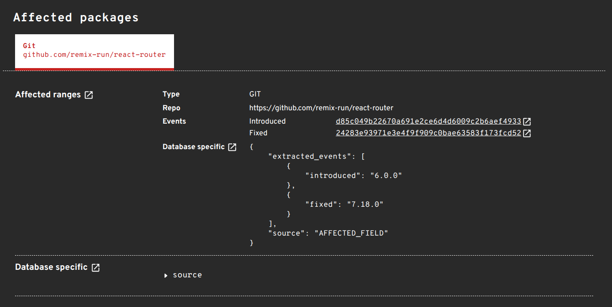

We’ve recently rolled out a series of major upgrades to the OSV.dev ingestion pipeline, including importing data from the CVE Program's [**CVEList**](https://github.com/CVEProject/cvelistV5) directly. These changes focus on getting vulnerability data into OSV faster, improving record provenance, and dramatically reducing backend processing times.

<!--more-->
---

## TL;DR

* **Direct CVE 5.0 Ingestion**: We now ingest `CVEList` directly from the CVE Program, producing records without waiting for NVD updates or CPE string attachments.  
* **Better Data Provenance**: Records track the exact raw versions extracted before commit resolution and the fields used to produce final commit ranges.  
* **Faster Pipelines**: Performance optimisations \= faster advisory matching. 

---

## Why Direct CVEList Ingestion Matters

Historically, OSV has relied heavily on the National Vulnerability Database (NVD) for CPE strings and repository references. Processing slowdowns at NVD over the past few years resulted in a bottleneck, delaying when new advisories appear in OSV.

To address this, we built a native pipeline to ingest the CVE Program's official **CVEList** repository using the **CVE 5.0 Schema**.

Because CVE 5.0 records come directly from CVE Numbering Authorities (CNAs), they often contain version ranges and fix commits right at publication time. Ingesting the CVEList directly lets OSV publish actionable vulnerability records immediately, without waiting for third-party CPE assignment. 

---

## What Our CVE Records Cover (and What They Don’t)

> **OSV.dev is not a mirror for all CVE records.**

Our CVE ingestion focuses specifically on vulnerabilities where we can identify:

1. An open-source code repository (e.g., GitHub, GitLab, Bitbucket), and  
2. Resolvable version tags or Git commit hashes.

### Why limit the scope?

Neither CVE 5.0 nor NVD records are guaranteed to contain structured, matchable package manager metadata (such as PyPI, npm, Maven, or Cargo package names). At scale, it is exceptionally difficult to reliably determine which ecosystem a raw CVE belongs to, nor can we easily extend our current logic to enumerate unfamiliar or proprietary ecosystems.

Fortunately, ecosystem advisories like GitHub Security Advisories (GHSA), PyPA, and RustSec already provide package-specific mappings for their respective ecosystems. For raw CVEs, we focus on what we can deterministically derive: **open-source repository commit and version history**.

If a CVE includes repository links and fix details, OSV converts them into precise Git version ranges. If a CVE relates to closed-source software or lacks identifiable repository data, it remains outside the scope of OSV's automated CVE ingestion.

---

## Performance, Provenance, and Record Merging

Ingesting from both CVEList and NVD requires merging rules to keep data clean. Our merging logic combines CVE 5.0 and NVD records by prioritizing explicit fix commits and bounded version ranges over loose or open-ended ranges.

We also expanded data provenance tracking:

* Vulnerability records now log the exact raw versions extracted before commit resolution (stored in `extracted_events` inside the affected range’s `database_specific` field).  
* Metadata in `database_specific` list the exact fields and source references used to produce final commit ranges.

These additions make it clear where data originated and how a commit range was determined.

Alongside data quality improvements, we streamlined our backend pipelines to deliver new vulnerability updates faster. For developers and security tools relying on OSV.dev, this means newly published CVE fixes and advisories are available for scanning much, much faster. The end result is reduced vulnerability exposure windows, and faster remediation\! 

---

## Looking Ahead

Direct CVEList ingestion, clear scope boundaries, improved provenance tracking, and faster pipelines keep OSV.dev up to date and transparent.

If you have feedback or want to contribute to our ingestion tools, check out our repository on [GitHub](https://github.com/google/osv.dev).