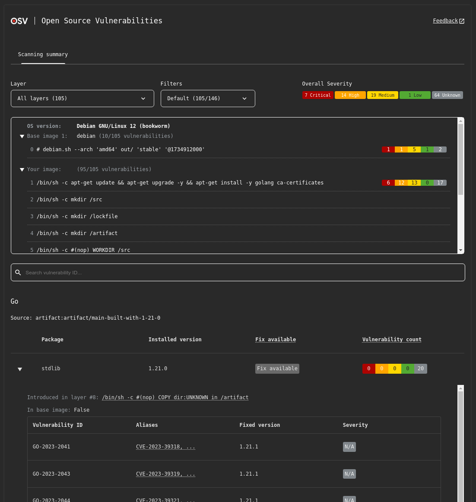

Today we’re excited to announce that the first beta of OSV-Scanner V2 is ready! The team has been hard at work in the past months to revamp OSV-Scanner under the hood (transitioning to [OSV-Scalibr](https://github.com/google/osv-scalibr), which we announced last month) and building several new significant features.

This beta release does *not* introduce any breaking CLI changes - existing OSV-Scanner can use the tool in exactly the same way. The beta period is expected to last approximately one month. However, as this is a beta release, there may be breaking changes in the final release compared to the beta.


## Layer and base image-aware container scanning

A significant new feature is a rewritten, layer-aware container scanning support for Debian, Ubuntu, and Alpine container images. OSV-Scanner can now analyze container images to provide:

- Layers where a package was first introduced
- Layer history and commands
- Base images the image is based on
- OS/Distro the container is running on

This layer analysis leverages [OSV-Scalibr](https://github.com/google/osv-scalibr), and supports the following OSes and languages:
| Distro Support | Language Artifacts Support |
| -------------- | -------------------------- |
| Alpine OS | Go |
| Debian | Java |
| Ubuntu | Node |
| | Python |

Base image identification also leverages a new experimental API provided by https://deps.dev.

For usage, run the new `scan image` command:

```
osv-scanner scan image <image-name>:<tag>
```

Check out our [documentation](https://google.github.io/osv-scanner/usage/scan-image) for more details.

## Interactive HTML output

A new interactive HTML output is now available. This provides a lot more interactivity and information compared to terminal only outputs, including:

- Severity breakdown
- Package and ID filtering
- Vulnerability importance filtering
- Full vulnerability advisory entries

And additionally for container image scanning:

- Layer filtering
- Image layer information
- Base image identification



## Guided Remediation for Maven pom.xml

Last year we released a feature called [guided remediation](https://osv.dev/blog/posts/announcing-guided-remediation-in-osv-scanner/) for npm. We have now expanded support to Maven pom.xml.

With guided remediation support for Maven, you can remediate vulnerabilities in both direct and transitive dependencies through direct version updates or overriding versions through dependency management.

We’ve introduced a few new features for our Maven support:

- A new remediation strategy `override` is introduced.
- Support for reading and writing pom.xml files, including writing changes to local parent pom files.
- Private registry can be specified to fetch Maven metadata.

The guided remediation support for Maven is only available in the non-interactive mode. For basic usage, run the following command:

```
osv-scanner fix --non-interactive --strategy=override -M path/to/pom.xml
```

We also introduced machine readable output for guided remediation that makes it easier to integrate guided remediation into your workflow.

For more usage details on guided remediation, please see our [documentation](https://google.github.io/osv-scanner/experimental/guided-remediation/).

## Enhanced Dependency Extraction with `osv-scalibr`

With the help from [OSV-Scalibr](https://github.com/google/osv-scalibr), we now also have expanded support for the kinds of dependencies we can extract from projects and containers:

Source manifests and lockfiles

- Haskell: `cabal.project.freeze`, `stack.yaml.lock`
- .NET: `deps.json`
- Python: `uv.lock`

Artifacts

- node_modules
- Python wheels
- Java uber jars
- Go binaries

The full list of supported formats can be found [here](https://google.github.io/osv-scanner/supported-languages-and-lockfiles/).

The first beta doesn’t enable every single extractor currently available in OSV-Scalibr today. We’ll continue to add more leading up to the final 2.0.0 release.

OSV-Scalibr also makes it incredibly easy to add new extractors. Please file a [feature request](https://github.com/google/osv-scalibr/issues) if a format you’re interested in is missing!

## Feedback and testing

You can find our latest release on GitHub here, and our updated V2 documentation here.

We still expect changes to be made, smaller new features to be added, and bugs to be shaken out leading up to the final v2.0.0 release. If you do give this a try, we’d appreciate any feedback you might have on our discussion topics:
- [General V2 feedback](https://github.com/google/osv-scanner/discussions/1529)
- [Container scanning feedback](https://github.com/google/osv-scanner/discussions/1521)

The OSV project is fully open source, and guided by the feedback from our open source community. Together we can build better open source tools to make vulnerability management easier and less noisy!
