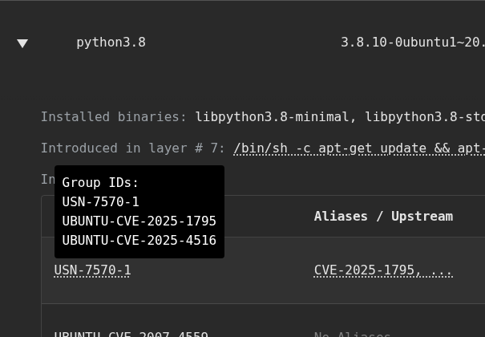

  
Linux distributions often maintain their own advisories to announce fixes based on source CVEs and operate security trackers to monitor unfixed vulnerabilities. For example, Debian and Ubuntu use Debian Security Advisories (DSAs) and Ubuntu Security Notices (USNs), respectively. This is necessary because Linux distributions apply and backport patches, which means the impact and required fixes for a single upstream CVE can differ significantly across various distributions.

OSV.dev ingests data from various sources, which complicates Linux system scanning. Scanners may identify multiple records for the same underlying vulnerability, such as the original source [CVE](https://osv.dev/vulnerability/CVE-2025-27613), a distribution-specific tracker CVE (e.g., [UBUNTU-CVE](https://osv.dev/vulnerability/UBUNTU-CVE-2025-27613)), and the official patch (e.g., [USN](https://osv.dev/vulnerability/USN-7626-1)). For users trying to determine if their Linux VM/container is affected by a specific CVE, navigating these interconnected records can be confusing and hinder efforts to find the most relevant information for remediation.

After much discussion with the wider Linux community, the OSV schema introduced an ["upstream" field late last year](https://github.com/ossf/osv-schema/pull/312). This addition aims to explicitly define the relationships between distribution-tracked and updated vulnerabilities/advisories and their corresponding upstream CVEs, simplifying vulnerability analysis and resolution. 

### Establishing relationships between records

Prior to the `upstream` addition, the OSV schema supported the `related` and `aliases` fields to capture various connections between vulnerabilities. 

`upstream`: This field describes advisory records that are directly addressed by the current record e.g. CVE-XXX is upstream of DSA-XXX  
`aliases`: This field captures alternative identifiers for a specific vulnerability, such as different CVE IDs, where their vulnerability and advisory are the same, where there are no functional differences between the records beyond their identifiers.  
`related`: This field is used to link vulnerabilities that share a common root cause or impact, even if they manifest differently across different software packages or versions, while not being an alias, upstream or downstream manifestation of another record.

Some records that once were listed in `related` have been moved to the `upstream` field to facilitate this change. As of time of writing, we have vulnerability records across RedHat, Debian, Ubuntu, Chainguard, MinimOS and SUSE supporting this change. 

### What does this mean for you?
The OSV.dev API and frontend now support this field. Querying the API returns the complete transitive list of upstream records, while the website further displays the hierarchy among the vulnerability entries.

### How does osv-scanner use this to reduce noise from the scanning report? 
We prioritize official Linux distribution advisories and notices (e.g., USN or DSA) over their security tracker data (e.g., UBUNTU-CVE). This is because advisories typically bundle multiple related issues into a single, triaged, and fixed patch. Consequently, the scanner will now display only the furthest downstream advisory in the final report, while corresponding upstream CVEs will be grouped under its ID and hidden. For instance, a USN will be shown instead of individual UBUNTU-CVE or CVE entries. This approach minimizes the effort of repeatedly reviewing the same underlying vulnerabilities, as they are ultimately addressed by a single corrective action.

Ultimately, the integration of the "upstream" field into the OSV schema offers a more unified and efficient approach to managing Linux distribution vulnerabilities. By clearly establishing the connection between upstream CVEs and downstream distribution advisories like USNs and DSAs, we’re significantly reducing the clutter of vulnerability reports. This improvement in our API, frontend, and osv-scanner empowers users to focus on the official, triaged fixes provided by their distributions, leading to faster and more accurate remediation. We invite you to leverage these enhanced capabilities on OSV.dev and experience a clearer, more streamlined path to securing your Linux systems.

If you are interested in learning more about this change, and how we reduce noise, check out our recent talk from the Open Source Summit North America \- [Navigating the Sea of CVEs](https://www.youtube.com/watch?v=Vsp-RuwJM8c).
