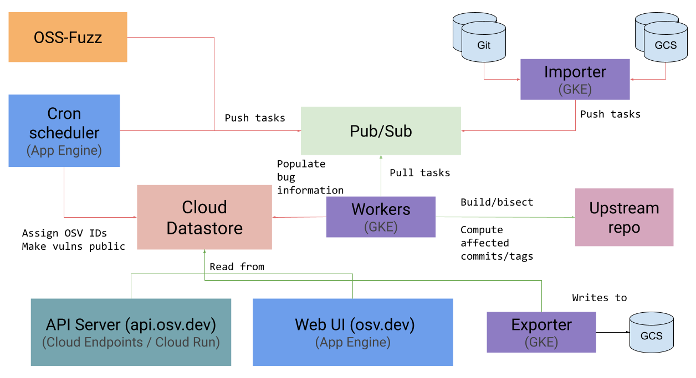

# Architecture

  

## Data source

Our data is sourced from a variety of [sources], which we are looking to expand
on over time.

[sources]: https://github.com/google/osv.dev#current-data-sources

OSV runs on Google Cloud Platform, with the following main components:

## Cloud Datastore

All vulnerability data is stored in [Cloud Datastore], with the [models] defined
[here].

[Cloud Datastore]: https://cloud.google.com/datastore
[models]:
https://googleapis.dev/python/python-ndb/latest/index.html#defining-entities-keys-and-properties
[here]: https://github.com/google/osv/blob/master/osv/models.py

## Google Kubernetes Engine (GKE)

[GKE] is used for running [workers] to perform bisects and impact analysis.
These workers consume tasks from a [Cloud Pub/Sub] topic.

Workers are Docker containers, which use [gVisor] for sandboxing untrusted
workloads.

[GKE]: https://cloud.google.com/kubernetes-engine
[workers]: https://github.com/google/osv/tree/master/docker/worker
[gVisor]: https://gvisor.dev/
[Cloud Pub/Sub]: https://cloud.google.com/pubsub

## Cloud Run / Cloud Endpoints

The [API server] runs on [Cloud Run], and is served by [Cloud Endpoints].

[API server]: https://github.com/google/osv/tree/master/gcp/api
[Cloud Run]: https://cloud.google.com/run
[Cloud Endpoints]: https://cloud.google.com/endpoints

## App Engine

The main web UI (https://osv.dev) runs on [App Engine]. App Engine [cron jobs]
also schedule recurring tasks for the workers, allocate OSV IDs, and make
vulnerabilities public at the appropriate times.

[App Engine]: https://github.com/google/osv/tree/master/gcp/appengine
[cron jobs]: https://github.com/google/osv/blob/master/gcp/appengine/cron.yaml
