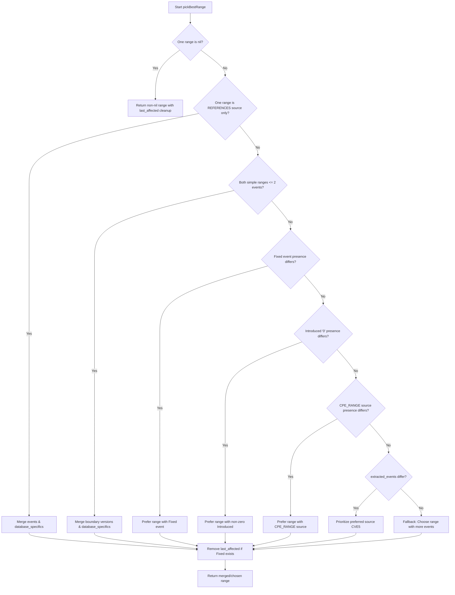

# Combine-to-OSV Range Selection & Merging Design

This document summarizes the design decisions and merging strategies implemented in the `combine-to-osv` tool to combine converted OSV records from NVD and CVE5 into a single enriched, schema-compliant OSV record.

---

## 1. Structural Decisions

### Unified Affected Package Grouping
Rather than outputting a separate `Affected` package object for each repository range, all repository-based Git ranges are grouped under a **single** `Affected` struct inside the final combined OSV record. Pure package-level entries (which contain only a package name without any ranges) are preserved as separate `Affected` objects.

---

## 2. Range Selection & Merging Strategy (`pickBestRange`)

When both NVD and CVE5 converted records contain Git ranges for the same repository, `pickBestRange` is used to determine the best combined range.

### 1. References-Only Merging
If one range's metadata source is **only** `"REFERENCES"` (meaning its commits were directly parsed from fix references), its events are appended and merged into the other CVE range instead of choosing one range wholesale. This preserves precise fix commits extracted from advisory links.

### 2. Boundary Version Merging
For simple version ranges (with two or fewer events), boundary versions are merged to combine the most complete and constrained information:
* We prefer more constrained introduced boundaries (e.g., a non-zero introduced version over a `"0"` version).
* We prefer defined fixed version boundaries over undefined ones.

### 3. Preference Rules (Wholesale Fallbacks)
If ranges are not simple enough to merge boundaries, we select the best range using the following hierarchy:
1. **Fixed Priority**: A range with bounded `fixed` version or commit information is prioritized over a range with open-ended `last_affected` information.
2. **Constrained Range Priority**: We prefer ranges that define a specific non-zero `introduced` bound over those that start at `"0"`.
3. **CPE_RANGE Source Priority**: We prefer ranges whose metadata source is `"CPE_RANGE"` because they are extracted from explicit config nodes rather than inferred from text.
4. **Preferred Source**: If all else is equal, we prefer the range from the default preferred source (`CVE5` CNA-provided data).
5. **Completeness**: Choose the range that has a larger number of Git commit events.

---

## 3. Metadata & Cleanup Rules

### Database Specific Merging
Whenever ranges are merged (either via boundary version merging or references-only merging), their `database_specific` metadata fields are combined:
* String `source` tags are merged into a unified `ListValue` list (e.g., `"AFFECTED_FIELD"` and `"REFERENCES"` are merged into `["AFFECTED_FIELD", "REFERENCES"]`).
* Duplicate entries inside `extracted_events` are removed.

### Last-Affected Cleanup
At the end of the selection or merging process, if the final range contains at least one explicit `fixed` commit or version event, any `last_affected` events are automatically removed from the range to maintain clean, bounded schema compliance.
