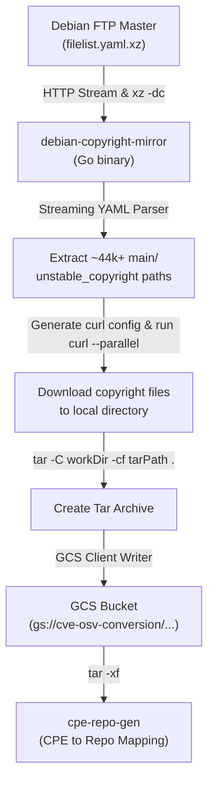

# Debian Copyright Mirror

`debian-copyright-mirror` maintains a mirror of machine-readable Debian package copyright files for packages in Debian `unstable` (`main` section).

---

## Purpose & Usage in OSV

In the OSV and vulnerability feeds pipeline, correlating Common Vulnerabilities and Exposures (CVE) entries and Common Platform Enumeration (CPE) identifiers with upstream open-source source code repositories (e.g., on GitHub, GitLab, or Git) is a crucial step for automated vulnerability management.

### The Problem
- CVE entries and NVD CPE dictionaries often lack structured upstream repository URLs, or only provide arbitrary website references.
- Without a reliable mapping from package names and CPE products to source code repositories, automated tools cannot easily determine affected Git commits, tags, or version ranges for Git-based vulnerability matching.

### How Debian Copyright Files Solve This
Debian packages in `unstable` follow the [Machine-readable debian/copyright format (DEP-5 / Copyright Specification 1.0)](https://www.debian.org/doc/packaging-manuals/copyright-format/1.0/). These files contain structured metadata in header paragraphs, notably:

```text
Format: https://www.debian.org/doc/packaging-manuals/copyright-format/1.0/
Upstream-Name: example-lib
Source: https://github.com/example/example-lib
```

The `Source:` field provides a canonical, maintainer-verified URL to the upstream open-source repository.

### Downstream Consumers
1. **`cpe-repo-gen`** (`cmd/mirrors/cpe-repo-gen`):
   - Downloads the `debian_copyright.tar` archive generated by this tool from Google Cloud Storage (`gs://cve-osv-conversion/debian_copyright/debian_copyright.tar`).
   - Scans the mirrored `unstable_copyright` files to resolve Debian package names and CPE products to upstream source code repositories.
   - Produces the canonical `cpe_product_to_repo.json` mapping.
2. **OSV Conversion & Enrichment Pipelines**:
   - Use the repository mappings derived from Debian copyright data to accurately calculate affected commit ranges, detect fixed revisions, and generate OSV-format records for Debian, NVD, and other feeds.

---

## How It Works



1. **Manifest Streaming & Decompression**: Fetches `filelist.yaml.xz` from `https://metadata.ftp-master.debian.org/changelogs/filelist.yaml.xz` over HTTP and streams it through `xz -dc` stdin.
2. **Manifest Parsing**: Parses the YAML manifest line-by-line to discover all packages containing an `unstable_copyright` entry under the `unstable` suite in the `main` archive section.
3. **Validation**: Asserts that the number of discovered files meets a sanity threshold (by default, at least 40,000 files) to ensure upstream feeds were not corrupted or truncated.
4. **Parallel Downloads via Curl**: Generates a configuration file and executes `curl --parallel --create-dirs --config <config>` to download all copyright files into `<workDir>/metadata.ftp-master.debian.org/changelogs/`.
5. **Archiving & GCS Upload**: Uses `tar` to archive `<workDir>` (producing `./metadata.ftp-master.debian.org/changelogs/main/...` entries expected by `cpe-repo-gen`) and uploads the resulting `.tar` archive directly to Google Cloud Storage (e.g. `gs://cve-osv-conversion/debian_copyright/debian_copyright.tar`).

---

## CLI Usage

### Running Locally

```bash
# Build and run directly using Go
go run ./cmd/mirrors/debian-copyright-mirror [flags] [work_dir]
```

Examples:

```bash
# Download copyright files into ./debian_copyright (relative to current directory)
go run ./cmd/mirrors/debian-copyright-mirror

# Specify a custom relative output directory
go run ./cmd/mirrors/debian-copyright-mirror -out-dir debian_copyright

# Download and create a local tar archive
go run ./cmd/mirrors/debian-copyright-mirror -tar-path debian_copyright.tar

# Download and upload directly to GCS
go run ./cmd/mirrors/debian-copyright-mirror -gcs-path gs://my-bucket/debian_copyright.tar
```

### Flags

| Flag | Type | Default | Description |
| :--- | :--- | :--- | :--- |
| `-out-dir` | string | `debian_copyright` | Target directory to save downloaded copyright files (defaults to `$WORK_DIR` if set). |
| `-work-dir` | string | `""` | Alias for `-out-dir` (can also be passed as the first positional argument). |
| `-tar-path` | string | `""` | Optional local destination path for tarball archive (e.g. `debian_copyright.tar`). |
| `-gcs-path` | string | `""` | Destination GCS path for the tarball archive (defaults to `$GCS_PATH` if unset). |
| `-filelist-url` | string | `https://metadata.ftp-master.debian.org/changelogs/filelist.yaml.xz` | URL of the Debian filelist YAML archive. |
| `-url-base` | string | `https://metadata.ftp-master.debian.org/changelogs` | Base URL for downloading individual copyright files. |
| `-prefix-filter` | string | `main/` | Archive section prefix to filter (e.g., `main/`). |
| `-min-expected-files` | int | `40000` | Minimum expected number of copyright files; fails if fewer are found. |

---

## Docker & Deployment

### Building the Docker Container

Build the container image from the `vulnfeeds/` directory:

```bash
docker build -t gcr.io/oss-vdb/debian-copyright-mirror:latest -f cmd/mirrors/debian-copyright-mirror/Dockerfile .
```

### Kubernetes CronJob Deployment

In production, this mirror runs as a scheduled Kubernetes `CronJob` in GKE (defined in `deployment/clouddeploy/gke-workers/base/feeds/debian-copyright-mirror.yaml` and environment overlays):

- **Schedule**: Runs daily (`0 5 * * *` Sydney time).
- **Entrypoint**: Runs the `debian-copyright-mirror` Go binary directly, which reads `WORK_DIR` (e.g. `/scratch`) and `GCS_PATH` (e.g. `gs://cve-osv-conversion/debian_copyright/debian_copyright.tar`) from the environment, downloads with `curl`, packages with `tar`, and uploads the archive to Cloud Storage.
